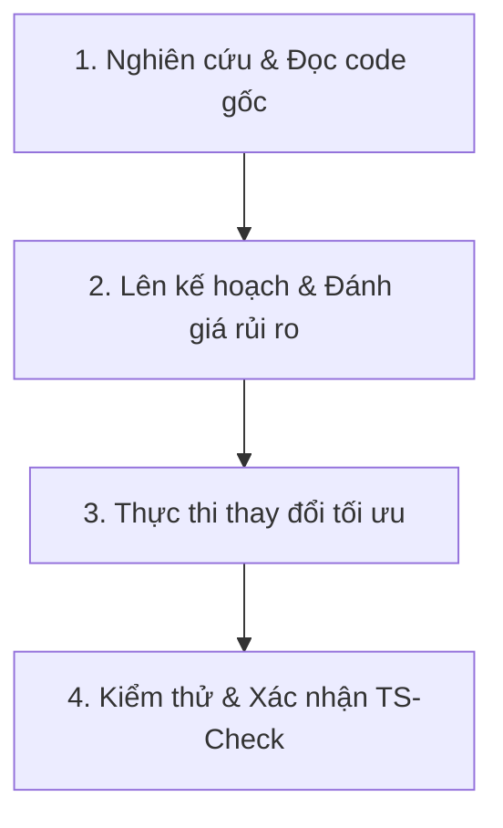

# Quy trình Làm việc (Development Workflow) - DBAQ LMS

Tài liệu này hướng dẫn quy trình từng bước cho AI Agents và các Lập trình viên khi thực hiện các yêu cầu thay đổi trong codebase.

---

## 1. Quy trình 4 Bước Phát triển & Sửa đổi



### Bước 1: Nghiên cứu & Đọc code gốc (Mandatory Research)
- **KHÔNG ĐOÁN CODE**: Trước khi sửa bất kỳ file nào, dùng `view_file` hoặc `grep_search` để đọc cấu trúc thật.
- Kiểm tra lại các file quy định: [AGENTS.md](file:///d:/Code/dbaq-lms/AGENTS.md) và [.agents/DESIGN.md](file:///d:/Code/dbaq-lms/.agents/DESIGN.md).

### Bước 2: Lên kế hoạch & Đánh giá rủi ro
- Xác định phạm vi ảnh hưởng (Impact radius) của thay đổi.
- Nếu chỉnh sửa hàm dùng chung trong `src/lib/`, tìm kiếm tất cả các vị trí đang gọi hàm đó để cập nhật đồng bộ.

### Bước 3: Thực thi thay đổi tối ưu
- Thực hiện chỉnh sửa theo đúng quy chuẩn [docs/conventions.md](file:///d:/Code/dbaq-lms/docs/conventions.md).
- Ưu tiên sử dụng `replace_file_content` hoặc `multi_replace_file_content` cho các thay đổi cục bộ.

### Bước 4: Kiểm thử & Xác nhận TypeScript (`npx tsc --noEmit`)
- Sau khi chỉnh sửa code, **BẮT BUỘC** chạy lệnh kiểm tra cú pháp TypeScript:
  ```bash
  npx tsc --noEmit
  ```
- Nếu có lỗi TypeScript, phải xử lý dứt điểm trước khi báo hoàn thành với người dùng.

---

## 2. Quy trình Cập nhật Icon / Logo / PWA
Khi nhận được yêu cầu đổi Logo hoặc Icon hiển thị trang web:
1. Đọc chi tiết tài liệu [.agents/UPDATE_ICON_GUIDE.md](file:///d:/Code/dbaq-lms/.agents/UPDATE_ICON_GUIDE.md).
2. Tạo/copy ảnh đúng kích thước chuẩn.
3. Cập nhật số phiên bản cache-buster trong manifest.
4. Copy đồng bộ tới 3 thư mục quy định để tránh lỗi cache thiết bị.
